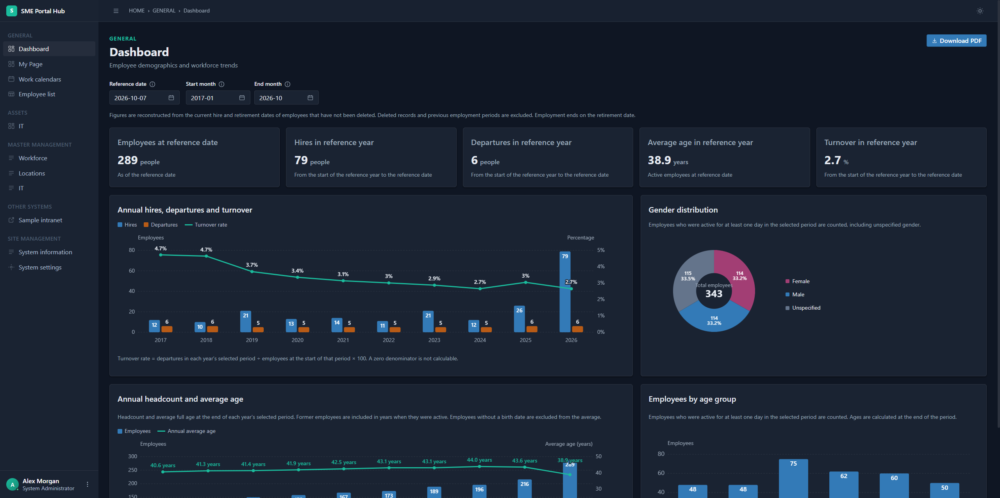
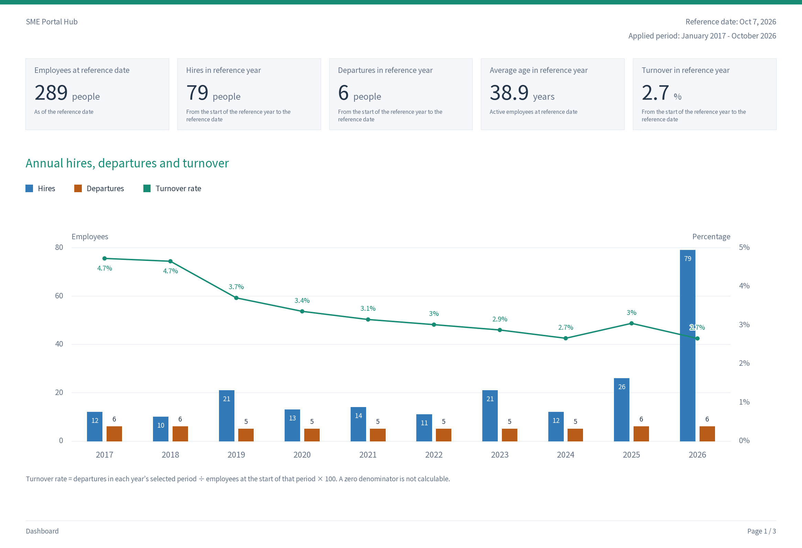
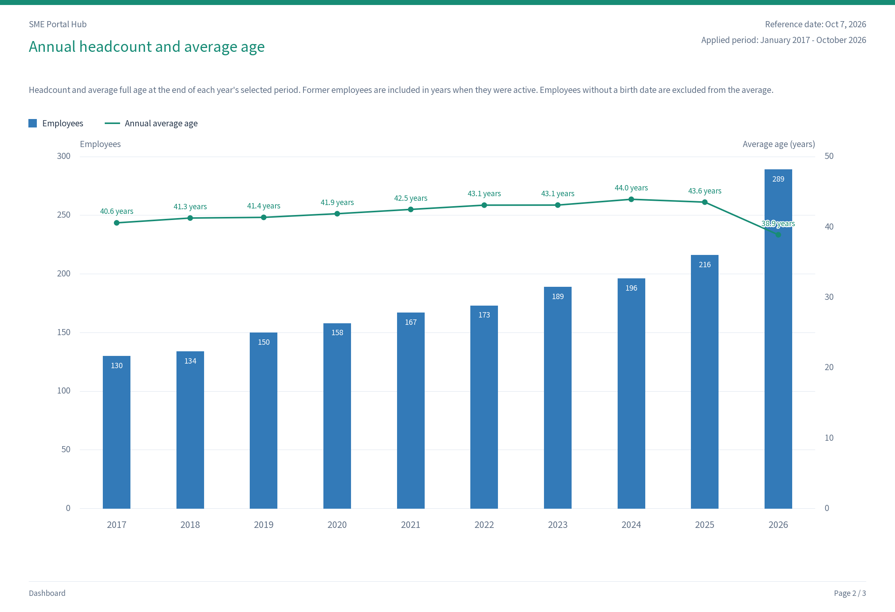
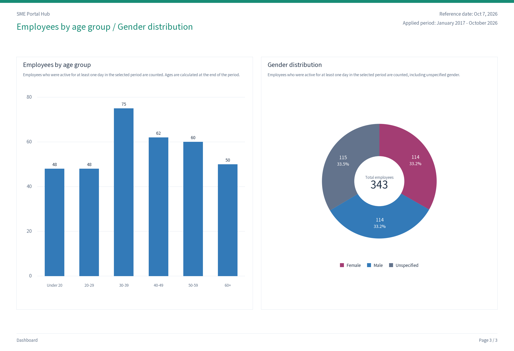
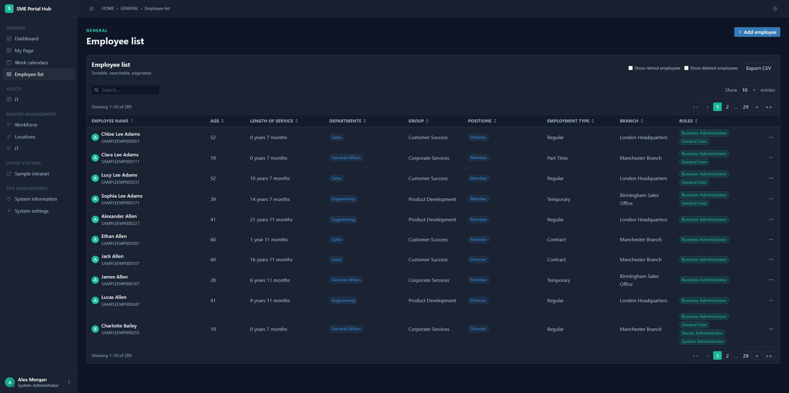
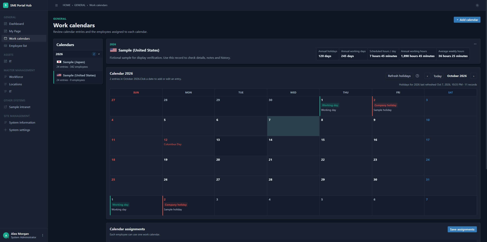

# SME Portal Hub ( SPH )

[日本語版はこちら](./README_JA.md)

[](https://github.com/HidekiMorisaki/sph/releases) [](https://github.com/HidekiMorisaki/sph/blob/main/LICENSE)



SME Portal Hub (abbreviated as SPH) is a web-based system that enables small and medium-sized enterprises to build their own internal portal sites. It is being developed to streamline internal operations and bring company information together in one place through capabilities such as employee management, internal calendar creation and publishing, and IT asset management.

> [!NOTE]
> SPH is currently under active development. It can be installed and evaluated, but some functionality remains incomplete. Existing features may also change substantially in future updates.

| Your goal | Read this section |
| --- | --- |
| Install, try, or use the system | [Quick Start for Users](#quick-start-for-users) |
| Install on a server for access from other PCs | [Installing on a server or another PC](#installing-on-a-server-or-another-pc) |
| Diagnose an installation problem | [Quick Start troubleshooting](#quick-start-troubleshooting) |
| Start or stop an existing installation | [Starting and stopping the system](#starting-and-stopping-the-system) |
| Upgrade an existing installation | [Upgrading to the latest version](#upgrading-to-the-latest-version) |

The system includes:

- Employee management and role-based access control
- Internal calendar creation and publishing
- Branch, room, and storage-location management
- IT asset records, assignments, returns, and change history
- Master data for employees and IT assets
- Dashboards and user settings

## Quick Start for Users

### 1. Prerequisites

Git, Docker, and Docker Compose are required for installation. Install them beforehand and confirm that they work correctly.
The web interface uses port `3000` (changeable in the installer), and the database uses port `5432`. Confirm that these ports are not already used by other software.

### 2. Download

```bash
git clone https://github.com/HidekiMorisaki/sph.git
cd sph
```

### 3. Run the installer

| Platform | Run from the downloaded folder |
| --- | --- |
| Windows | Double-click `install.bat`, or run `.\install.ps1` in PowerShell. |
| macOS / Linux | Run `bash ./install.sh` in a terminal. |

The installer supports English and Japanese. After selecting the display language, follow the interactive prompts to install the system. The installer builds and starts the system, then shows the URL and sign-in instructions.

> [!NOTE]
> At the "Optional fictional sample data" prompt, select "2. Add localized samples" to automatically add sample data in the selected language. Use these samples to evaluate SPH.
> The sample Work calendars also attempt to import the current year's Japanese Cabinet Office and U.S. OPM holidays. If either source is unavailable, the other samples are still installed. After signing in, select **Refresh holidays** on the affected Work calendar.

## Installing on a server or another PC

Run the download and installer steps on the machine that will host the system.
When prompted for connection settings:

- **Docker host web port**: select an unused port on the server, such as `3000` or `8080`.
- **Application URL**: enter the URL that users will open, such as `https://portal.example.internal`. Use a hostname or IP reachable from their PCs; `localhost` refers to each user's own PC.

Allow the selected web port through the server firewall and configure DNS if using
a hostname. Users then open the configured application URL in their browsers.
Database port `5432` does not need to be accessible from user PCs.

Sign-in from other PCs requires HTTPS because session cookies are marked Secure.
Configure a TLS reverse proxy separately and enter its public URL,
such as `https://portal.example.com`. The Docker host web port remains the proxy's
backend destination. The installer does not provision certificates or a TLS proxy.
If the public URL check reports a warning, finish the DNS, firewall, and proxy
configuration, then verify access from a user PC.

For use on the installation PC, `http://localhost:<port>` supports account
invitations and asset credential access. An invitation link created at this
address can only be opened on that same PC. To invite someone on another PC,
open the system through its HTTPS application URL before creating the link.

Connection settings are saved as `APP_ORIGIN` and `HTTP_PORT` in `.env`.
If changing them later, update `CORS_ALLOWED_ORIGINS` to the same application URL
and run `docker compose up -d --no-build --no-deps api frontend gateway` to apply the changes.

## Quick Start troubleshooting

### The installer stopped

The installer is for new installations only. Existing `.env` files, SPH containers,
or the `sph-db-data` volume cause it to stop without replacing them. For an existing
installation, use the normal start, update, or recovery procedures.

Installation failures report the stopped stage, the failed
operation or detected condition, and the next checks to make. Docker's raw output
is suppressed because it can contain credentials. When the underlying cause is
unknown, the message says so; suggested checks are not a diagnosis.

If a new installation failed after saving `.env`, retain that file and database
storage. Resolve the prerequisite or startup problem, then run
`docker compose up -d --build --wait --wait-timeout 300` from the product repository
root and check service status below. If no configuration or SPH storage was
created, rerun the installer. Never generate a replacement encryption key for
encrypted data. Keep `.env` protected and back it up separately from the database.

After recovering startup, finish the removal of initial setup credentials. Remove
only `INITIAL_ADMIN_*` lines from `.env`, retaining the database password and
encryption key. Recreate `db` and `api` with
`docker compose up -d --no-build --no-deps --force-recreate --wait --wait-timeout 300 db api`,
then remove the completed migration container with `docker compose rm -f migration`
and verify the application responses below. If `.env.install-clean` remains,
keep it protected until recovery is complete, then securely remove this temporary
file. It may contain credentials.

### Verify the installation

Show all containers, including the one-time migration container:

```bash
docker compose ps -a
```

The expected state is:

- `db`, `api`, `frontend`, and `gateway` are running.
- If present, the one-time `migration` container has exited with status code `0`.

If startup is still in progress or a service failed, inspect the logs:

```bash
docker compose logs migration
docker compose logs api frontend gateway db
```

Verify the API through the gateway (replace the example port if changed):

```bash
curl http://localhost:3000/v1/health
```

Windows PowerShell users can run:

```powershell
Invoke-RestMethod http://localhost:3000/v1/health
```

A successful response reports that the `equipment-api` service is healthy.

### The web page does not open

Check that all long-running services are running and healthy:

```bash
docker compose ps -a
docker compose logs gateway frontend api
```

Also confirm that the selected web port is not already used by another application.

### The migration container failed

Review its logs:

```bash
docker compose logs migration
```

Common causes include missing or invalid `INITIAL_ADMIN_*` values, an initial password that does not meet the strength requirements, or employment type and branch names that do not match the initial master data.

After correcting `.env`, rerun:

```bash
docker compose up -d --build
```

### A port is already in use

The default Compose configuration binds the gateway to host port `3000` and PostgreSQL to host port `5432`. Select another web port in the installer. For an existing installation, change `HTTP_PORT` and the application URL settings in `.env`. Database port mappings can be changed in `docker-compose.yml`.

### Bind mounts do not work

Some Docker environments cannot reliably bind-mount projects stored on removable drives. Move the repository to an internal drive, such as `C:\projects\sph`, and start the system again.

## Starting and stopping the system

View service status:

```bash
docker compose ps -a
```

Follow logs:

```bash
docker compose logs -f
```

Restart the application:

```bash
docker compose restart
```

Stop and remove the containers while preserving database data:

```bash
docker compose down
```

Start the existing installation again:

```bash
docker compose up -d
```

Database data is stored in the named Docker volume `sph-db-data` and is retained by `docker compose down`. Do not add the `--volumes` option unless permanent data removal is intentional and a suitable backup exists.

## Upgrading to the latest version

To update an installed system, run the command for your operating system from the repository root. The update script stops services, creates and verifies a backup, then pulls source changes and restarts the system. Make sure the Git working tree is clean and the branch has an upstream remote.

Windows PowerShell:

```powershell
.\scripts\update.ps1
```

macOS or Linux:

```bash
./scripts/update.sh
```

### Updating from v0.2.1

The original v0.2.1 PowerShell script is incompatible with Windows PowerShell 5.1. Fetch the v0.2.1 maintenance fix first, then point the checkout at the v0.3.0 release branch. After v0.3.0 is published on `main`, run these commands from the repository root:

```powershell
git fetch origin
git pull --ff-only origin bugfix/v0.2.1
git branch --set-upstream-to=origin/main
.\scripts\update.ps1
```

On macOS/Linux, use the same Git commands and run `./scripts/update.sh` for the final command. The update script creates and verifies a database backup before it pulls v0.3.0. If the checkout has local changes, resolve them before starting; do not discard them as part of the update.

For backup locations and recovery steps, see [Backup, update, and restore](./docs/Backup_Update_and_Restore.md).

## Gallery

### Dashboard


### PDF export results




## Employee list


## Work calendars


## Acknowledgements

The UI design of SPH was inspired by [Gentelella v4 - Free Admin Dashboard Template](https://github.com/colorlibhq/gentelella). We are grateful to the Gentelella contributors—and to all developers who generously make high-quality design templates available to the community at no cost.
