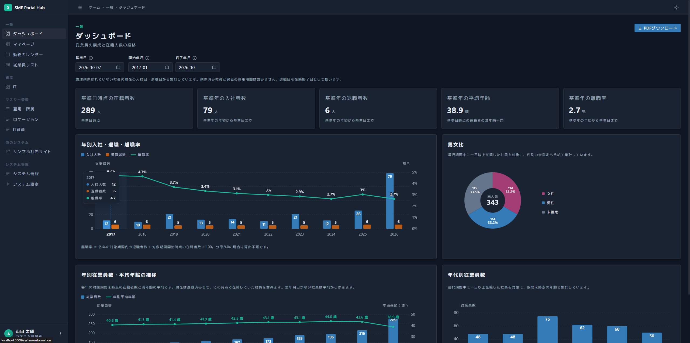
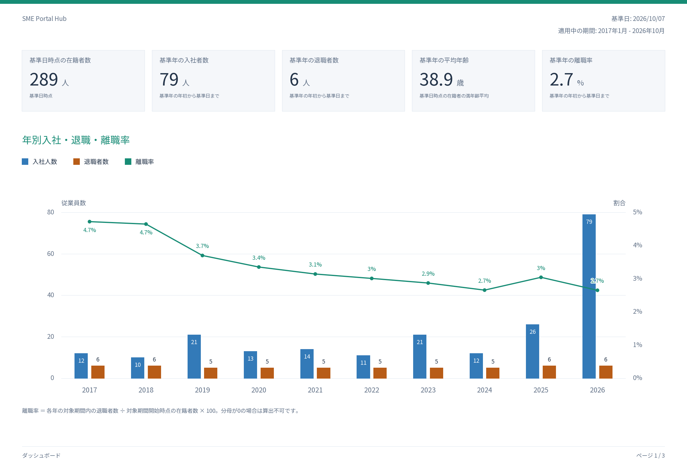
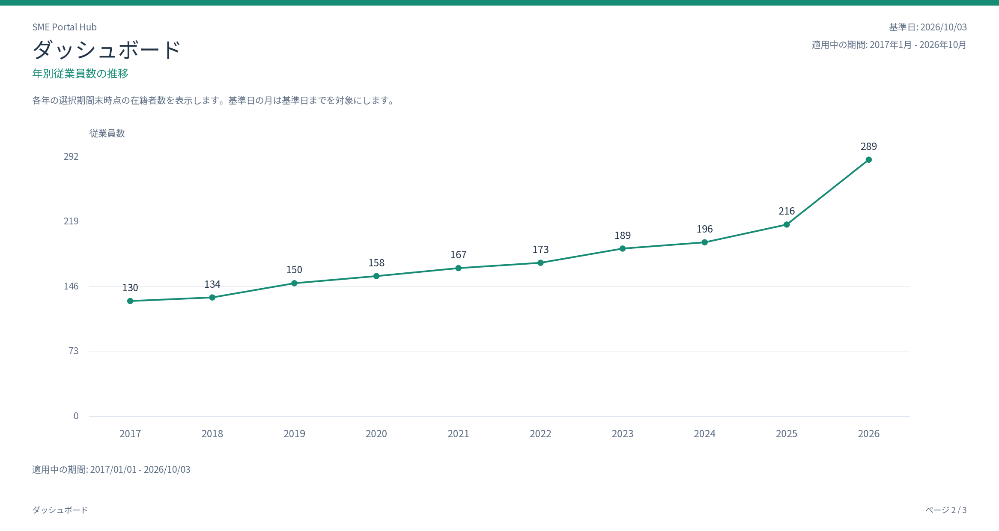
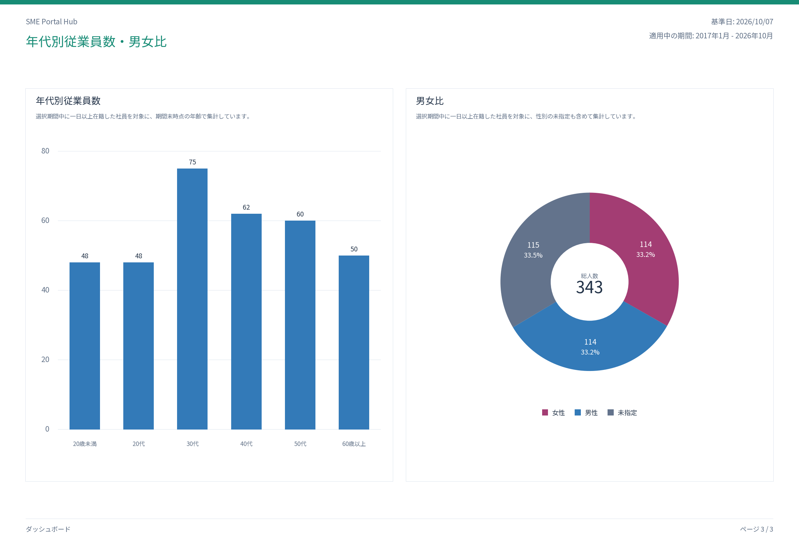
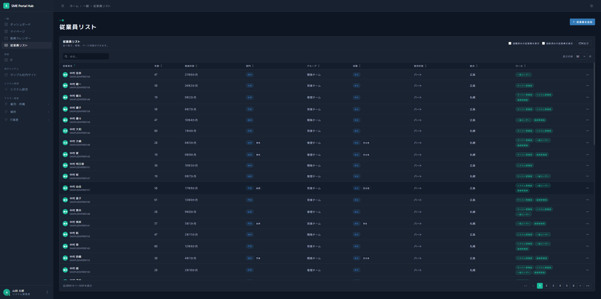
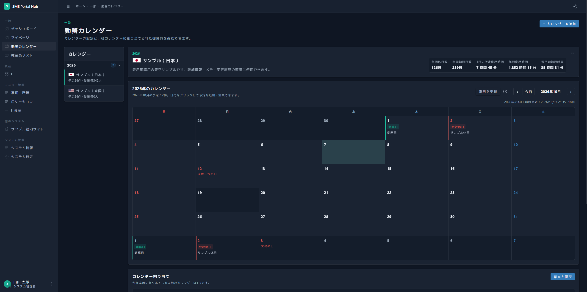

# SME Portal Hub ( SPH )

[English](./README.md)

[](https://github.com/HidekiMorisaki/sph/releases) [](https://github.com/HidekiMorisaki/sph/blob/main/LICENSE)



SME Portal Hub ( 略称：SPH ) は、中小企業が社内向けのポータルサイトを構築できる Web システムです。従業員管理、社内カレンダーの作成・公開、IT 資産管理などを通じて、社内業務の効率化と情報の集約を支援することを目指して開発しています。

> [!NOTE]
> SPH は現在、開発中です。
インストールして評価できますが、一部の機能は未完成です。既存機能も今後のアップデートで大幅に変更される可能性があります。

| 目的 | 参照するセクション |
| --- | --- |
| インストール・試用・利用する | [利用者向けクイックスタート](#quick-start-for-users) |
| 他の PC から利用できるようにサーバーへインストールする | [サーバーまたは別の PC へのインストール](#installing-on-a-server-or-another-pc) |
| インストール時の問題を調べる | [クイックスタートのトラブルシューティング](#quick-start-troubleshooting) |
| インストール済みのシステムを起動・停止する | [システムの起動と停止](#starting-and-stopping-the-system) |

本システムには、次の機能があります。

- 従業員管理とロールに基づくアクセス制御
- 社内カレンダーの作成・公開
- 拠点・部屋・保管場所の管理
- IT 資産の登録・割当・返却・変更履歴
- 従業員とIT資産に関するマスターデータ
- ダッシュボードとユーザー設定

<a id="quick-start-for-users"></a>

## 利用者向けクイックスタート

### 1. 事前準備

インストールするには Git、Docker、Docker Compose が必要です。事前にインストールして正常に動作することを確認してください。
Web インターフェース用のポートは`3000`（インストーラーで変更可能）、データベース用のポートは`5432`を使用します。これらのポートが他のソフトウェアで使用されていないことを確認してください。

### 2. ダウンロード

```bash
git clone https://github.com/HidekiMorisaki/sph.git
cd sph
```

### 3. インストーラーの実行

| プラットフォーム | ダウンロードしたフォルダーでの実行方法 |
| --- | --- |
| Windows | `install.bat`をダブルクリック、または PowerShell で`.\install.ps1`を実行 |
| macOS / Linux | ターミナルで`bash ./install.sh`を実行 |

インストーラーは英語と日本語に対応しています。表示言語を選択した後は、対話形式でインストールを行います。画面の案内に従ってインストールを行ってください。インストーラーがシステムをビルドして起動し、URL とログイン方法を表示します。

> [!NOTE]
> "架空のサンプルデータ（任意）" で "2：追加する" を選択することで、選択した言語に合わせたサンプルデータを自動的に追加することができます。SPH の評価にお役立てください。

<a id="installing-on-a-server-or-another-pc"></a>

## サーバーまたは別の PC へのインストール

システムを稼働させるコンピューターで、ダウンロードとインストーラーの実行を行ってください。接続設定の入力では、次の項目を指定します。

- **Docker ホストの公開ポート**：サーバーで使用していないポート（`3000`や`8080`など）を選択します。
- **アプリの URL**：利用者が開く URL（`https://portal.example.internal`など）を入力します。利用者の PC からアクセスできるホスト名または IP アドレスを使用してください。`localhost`は利用者自身の PC を指します。

サーバーのファイアウォールで選択した Web ポートへのアクセスを許可し、ホスト名を使用する場合は DNS を設定してください。利用者は、設定したアプリの URL をブラウザーで開きます。利用者の PC からデータベース用のポート`5432`へアクセスできるようにする必要はありません。

セッション Cookie には Secure 属性を設定しているため、他の PC からのログインには HTTPS が必要です。TLS 対応のリバースプロキシを別途構成し、その公開 URL（`https://portal.example.com`など）を入力してください。Docker ホストの公開ポートは、プロキシからシステムへの転送先になります。インストーラーは証明書や TLS プロキシを構成しません。公開 URL の確認で警告が表示された場合は、DNS・ファイアウォール・プロキシの設定を完了させ、利用者の PC からアクセスできることを確認してください。

インストールした PC では、`http://localhost:<ポート番号>`からアカウントの招待と資産の認証情報の表示を利用できます。このアドレスで作成した招待リンクを開けるのは同じ PC だけです。別の PC の従業員を招待する場合は、HTTPS のアプリ URL からシステムを開いてリンクを作成してください。

接続設定は、`.env`の`APP_ORIGIN`と`HTTP_PORT`に保存されます。後から変更する場合は、`CORS_ALLOWED_ORIGINS`にも同じアプリの URL を設定し、`docker compose up -d --no-build --no-deps api frontend gateway`を実行して変更を適用してください。

<a id="quick-start-troubleshooting"></a>

## クイックスタートのトラブルシューティング

### インストーラーが停止した場合

インストーラーは新規インストール専用です。既存の`.env`ファイル、SPH のコンテナー、または`sph-db-data`ボリュームがある場合は、それらを置き換えずに停止します。インストール済みの環境では、通常の起動・更新・復旧手順を使用してください。

インストールに失敗した場合は、停止した工程、失敗した操作または検出した状態、次に確認する事項を表示します。Docker の出力には認証情報が含まれる可能性があるため、そのまま表示することはありません。詳細な原因が不明な場合は、その旨を明示します。表示する確認事項は、原因を断定したものではありません。

新規インストールが`.env`の保存後に失敗した場合は、そのファイルとデータベース保存領域を保持してください。事前条件や起動時の問題を解消してから、製品リポジトリのルートで`docker compose up -d --build --wait --wait-timeout 300`を実行し、後述のサービス状態を確認してください。設定ファイルも SPH の保存領域も作成されていない場合は、インストーラーを再実行します。暗号化済みデータに対して、暗号化キーを新しく生成して置き換えないでください。`.env`は安全に保管し、データベースとは別にバックアップしてください。

起動を復旧した後は、初期設定用の認証情報の除去も完了させてください。データベースのパスワードと暗号化キーを保持したまま、`.env`から`INITIAL_ADMIN_*`の行だけを削除します。`docker compose up -d --no-build --no-deps --force-recreate --wait --wait-timeout 300 db api`で`db`と`api`を再作成し、`docker compose rm -f migration`で完了した migration コンテナーを削除してから、後述のアプリケーションの応答を確認してください。`.env.install-clean`が残っている場合は、復旧が完了するまで保護し、完了後にこの一時ファイルを安全に削除してください。認証情報が含まれる可能性があります。

### インストール結果の確認

一度だけ実行される migration コンテナーも含め、すべてのコンテナーを表示します。

```bash
docker compose ps -a
```

次の状態になっていることを確認してください。

- `db`、`api`、`frontend`、`gateway`が稼働している。
- 一度だけ実行される`migration`コンテナーが存在する場合は、終了コード`0`で終了している。

起動処理がまだ続いている場合やサービスが失敗した場合は、ログを確認します。

```bash
docker compose logs migration
docker compose logs api frontend gateway db
```

gateway 経由で API を確認します（ポートを変更した場合は、例のポート番号を置き換えてください）。

```bash
curl http://localhost:3000/v1/health
```

Windows の PowerShell では、次のコマンドを使用できます。

```powershell
Invoke-RestMethod http://localhost:3000/v1/health
```

成功した場合は、`equipment-api`サービスが正常であることを示す応答が返ります。

### Web ページが開かない場合

常時稼働するサービスがすべて起動し、正常な状態であることを確認してください。

```bash
docker compose ps -a
docker compose logs gateway frontend api
```

選択した Web ポートが、他のアプリケーションで使用されていないことも確認してください。

### migrationコンテナーが失敗した場合

ログを確認してください。

```bash
docker compose logs migration
```

よくある原因には、`INITIAL_ADMIN_*`の値の不足・不正、強度要件を満たさない初期パスワード、初期マスターデータと一致しない雇用形態名や拠点名があります。

`.env`を修正してから、次のコマンドを再実行してください。

```bash
docker compose up -d --build
```

### ポートが既に使用されている場合

既定の Compose 構成では、gateway にホストのポート`3000`、PostgreSQL にホストのポート`5432`を割り当てています。インストーラーで別の Web ポートを選択してください。インストール済みの環境では、`.env`の`HTTP_PORT`とアプリのURL設定を変更します。データベースのポート割当は、`docker-compose.yml`で変更できます。

### バインドマウントが機能しない場合

Docker の環境によっては、リムーバブルドライブ上のプロジェクトを正常にバインドマウントできないことがあります。リポジトリを`C:\projects\sph`などの内蔵ドライブへ移動し、システムを再度起動してください。

<a id="starting-and-stopping-the-system"></a>

## システムの起動と停止

サービスの状態を表示します。

```bash
docker compose ps -a
```

ログを継続して表示します。

```bash
docker compose logs -f
```

アプリケーションを再起動します。

```bash
docker compose restart
```

データベースのデータを保持したまま、コンテナーを停止・削除します。

```bash
docker compose down
```

インストール済みの環境を再度起動します。

```bash
docker compose up -d
```

データベースのデータは、名前付き Docker ボリューム`sph-db-data`に保存され、`docker compose down`を実行しても保持されます。データの永久削除を意図し、適切なバックアップがある場合を除き、`--volumes`オプションを追加しないでください。

## 最新バージョンへの更新

以前のバージョンから更新する場合は、Windows の PowerShell で、リポジトリのルートから次のコマンドを実行してください。

```powershell
docker compose stop gateway frontend api
git pull --ff-only
.\scripts\update.ps1
```

## ギャラリー

### ダッシュボード


### PDF エクスポート結果




## 従業員リスト


## 勤務カレンダー


## 謝辞

SPH の UI デザインは、[Gentelella v4 - Free Admin Dashboard Template](https://github.com/colorlibhq/gentelella) を参考にさせていただきました。Gentelella の貢献者の皆様、そして高品質なデザインテンプレートを無償でコミュニティに公開してくださるすべての開発者の皆様に感謝します。
